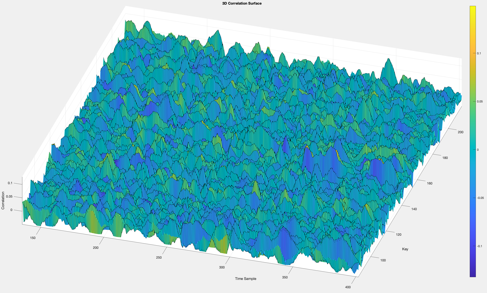

# CPA
TD CPA
Voici une explication détaillée de ce que fait le code :

## Chargement des données :

Le code charge trois ensembles de données :
- Les entrées `inputs.mat`, qui sont les données brutes à chiffrer.
- Une table de substitution `subBytes.mat`, qui est utilisée dans l'opération de substitution.
- Des traces de consommation de puissance `traces1000x512.mat`, qui sont des mesures de la consommation de puissance pendant le chiffrement.

### Code :

```mat
inputs = load('inputs.mat').Inputs1;
subBytes = load('subBytes.mat').SubBytes;
traces = load('traces1000x512.mat').traces;
```

## Initialisation des variables :

`num_traces` représente le nombre de traces de consommation de puissance.
`num_time_samples` représente le nombre d'échantillons de temps dans chaque trace.
`num_keys` est le nombre de clés possibles pour une sous-clé d'un octet (256 clés dans ce cas).
Une matrice __P__ est initialisée pour stocker les estimations de poids de Hamming pour chaque trace et chaque clé possible.

### Code :

```mat
num_traces = size(traces, 1);
num_time_samples = size(traces, 2);
num_keys = 256;
P = zeros(num_traces, num_keys);
```

## Boucle principale :

Une __boucle itère__ sur toutes les clés possibles (de 0 à 255).
Pour chaque clé, la boucle parcourt toutes les traces et fait ce qui suit :
- Effectue l'opération __AddRoundKey__ en effectuant un __XOR__ entre chaque octet d'entrée et la clé.
- Effectue l'opération __SubBytes__ en utilisant une table de substitution pour remplacer chaque octet par un autre octet selon la table.
- Estime le poids de __Hamming__ de la sortie de l'opération SubBytes.
- Stocke le poids de __Hamming__ estimé dans la matrice __P__.

### Code :

```mat
for k = 0:num_keys-1
    for i = 1:num_traces
        % Ensure the input is an integer before the XOR operation
        input_byte = uint8(inputs(i));  % Convert to unsigned 8-bit integer
        
        % Perform AddRoundKey (XOR with the key)
        roundKeyOutput = bitxor(input_byte, uint8(k));
        
        % Perform SubBytes operation
        subByteOutput = subBytes(roundKeyOutput+1); % MATLAB uses 1-indexing
        
        % Estimate the Hamming weight of the SubBytes output
        P(i, k+1) = sum(dec2bin(subByteOutput, 8) == '1');  % Ensure 8-bit representation
    end
end
```

## Calcul de la corrélation :

Une fois que les poids de Hamming ont été estimés pour toutes les clés et toutes les traces, le code calcule la corrélation entre les poids de Hamming et les traces de consommation de puissance.
Il génère une matrice de corrélation où chaque élément représente la corrélation entre le poids de Hamming pour une clé donnée et chaque échantillon de temps dans les traces de consommation de puissance.

### Code

```mat
correlation_matrix = zeros(num_keys, num_time_samples);
for k = 1:num_keys
    for t = 1:num_time_samples
        R = corrcoef(P(:, k), traces(:, t));
        correlation_matrix(k, t) = R(1, 2);  % Use the off-diagonal element
    end
end
```

## Identification de la clé probable :

Le code identifie la clé probable en trouvant la clé qui a la plus grande corrélation avec les traces de consommation de puissance.

## Tracé des graphiques :

Le code trace deux graphiques :

1. Un tracé de corrélation 2D qui montre la corrélation maximale pour chaque échantillon de temps.
2. Une surface 3D de corrélation qui montre la corrélation pour chaque échantillon de temps en fonction de chaque clé.

### Code :

```mat
% Plotting 2D correlation
plot(correlation_matrix(max_key_index, :));
title('2D Correlation Plot');
xlabel('Time Sample');
ylabel('Correlation');

% Plotting 3D correlation
surf(correlation_matrix);
title('3D Correlation Surface');
xlabel('Time Sample');
ylabel('Key');
zlabel('Correlation');
```

### Graph :



## Clé probable :

Le code identifie la clé probable en choisissant la clé avec la plus grande corrélation.

### Code :

```mat
[~, max_key_index] = max(max(correlation_matrix, [], 2));
```

## Conclusion :

Le code implémente une attaque de type DPA ou SPA pour retrouver la clé secrète utilisée dans le chiffrement à partir des traces de consommation de puissance et des données d'entrée chiffrées.
