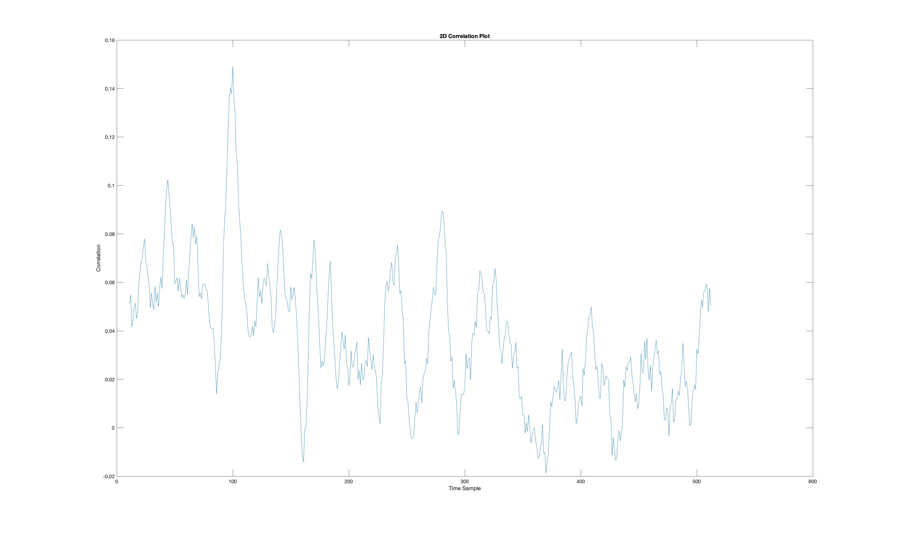

# CPA

Voici une explication détaillée de ce que fait le code :

## Sommaire

0. [Sujet](#0---sujet)
1. [Obtenir le Code](#1---obtenir-le-code)
2. [Changement des données](#2---chargement-des-données)
3. [Initialisation des variable](#3---initialisation-des-variables)
4. [Boucle principale](#4---boucle-principale)
5. [Calcule de la corrélation](#5---calcul-de-la-corrélation)
6. [Identification de la clé probale](#6---identification-de-la-clé-probable)
7. [Tracé des graphiques](#7---tracé-des-graphiques)
8. [Clé probable](#8---clé-probable)
9. [Conclusion](#9---conclusion)

## 0# - Sujet

L’objectif de ce TP est de réaliser l’attaque __CPA__ d’un chiffrement __AES__ implanté dans un __FPGA__ à partir de traces fournies. L’attaque ne cible que le premier octet de la clé secrète. Le code de l’attaque sera développé avec __MATLAB__. 

Vous devez donc modéliser en langage Matlab les deux premières étapes de l’algorithme __AES__ (__AddRoundKey__ et __SubBytes__), puis vous devez modéliser le calcul de la matrice __P__ d’estimation du poids de __Hamming__ de la sortie de l’opération __SubBytes__ pour toutes les sous-clés possibles.

Enfin un calcul de corrélation doit vous permettre d’extraire la valeur de la clé secrète, comme celle qui donne le maximum de corrélation. Vous devrez présenter dans un compte rendu une visualisation graphique en 2D et 3D de la corrélation afin de mettre en évidence les points d’intérêts (fuites d’information) lors du chiffrement. 

## 1# - Obtenir le Code

Pour obtenir le code source de ce projet, suivez les étapes ci-dessous :

Si vous avez Git installé, vous pouvez cloner le référentiel en utilisant la commande suivante dans votre terminal :

```bash
git clone https://github.com/votre-utilisateur/nom-du-projet.git
```

## 2# - Chargement des données :

Le code charge trois ensembles de données :
- Les entrées `inputs.mat`, qui sont les données brutes à chiffrer.
- Une table de substitution `subBytes.mat`, qui est utilisée dans l'opération de substitution.
- Des traces de consommation de puissance `traces1000x512.mat`, qui sont des mesures de la consommation de puissance pendant le chiffrement.

### Code :

```matlab
inputs = load('inputs.mat').Inputs1;
subBytes = load('subBytes.mat').SubBytes;
traces = load('traces1000x512.mat').traces;
```

## 3# - Initialisation des variables :

`num_traces` représente le nombre de traces de consommation de puissance.
`num_time_samples` représente le nombre d'échantillons de temps dans chaque trace.
`num_keys` est le nombre de clés possibles pour une sous-clé d'un octet (256 clés dans ce cas).
Une matrice __P__ est initialisée pour stocker les estimations de poids de Hamming pour chaque trace et chaque clé possible.

### Code :

```matlab
traces_size = size(traces, 1);
time_samples_size = size(traces, 2);
keys_size = 256;
P = zeros(traces_size, keys_size);
```

## 4# - Boucle principale :

Une __boucle itère__ sur toutes les clés possibles (de 0 à 255).
Pour chaque clé, la boucle parcourt toutes les traces et fait ce qui suit :
- Effectue l'opération __AddRoundKey__ en effectuant un __XOR__ entre chaque octet d'entrée et la clé.
- Effectue l'opération __SubBytes__ en utilisant une table de substitution pour remplacer chaque octet par un autre octet selon la table.
- Estime le poids de __Hamming__ de la sortie de l'opération SubBytes.
- Stocke le poids de __Hamming__ estimé dans la matrice __P__.

### Code :

```matlab
for k = 0:keys_size-1
    for i = 1:traces_size
        input_byte = uint8(inputs(i)); 
        roundKeyOutput = bitxor(input_byte, uint8(k));
        subByteOutput = subBytes(roundKeyOutput+1); 
        P(i, k+1) = sum(dec2bin(subByteOutput, 8) == '1'); 
    end
end
```

## 5# - Calcul de la corrélation :

Une fois que les poids de Hamming ont été estimés pour toutes les clés et toutes les traces, le code calcule la corrélation entre les poids de Hamming et les traces de consommation de puissance.
Il génère une matrice de corrélation où chaque élément représente la corrélation entre le poids de Hamming pour une clé donnée et chaque échantillon de temps dans les traces de consommation de puissance.

### Code :

```matlab
corr_matrix = zeros(keys_size, time_samples_size);
for k = 1:keys_size
    for t = 1:time_samples_size
        R = corrcoef(P(:, k), traces(:, t));
        corr_matrix(k, t) = R(1, 2);  
    end
end
```

## 6# - Identification de la clé probable :

Le code identifie la clé probable en trouvant la clé qui a la plus grande corrélation avec les traces de consommation de puissance.

### Code :
```matlab
[~, key_index_max] = max(max(corr_matrix, [], 2));
```

## 7# - Tracé des graphiques :

Le code trace deux graphiques :

1. Un tracé de corrélation 2D qui montre la corrélation maximale pour chaque échantillon de temps.
2. Une surface 3D de corrélation qui montre la corrélation pour chaque échantillon de temps en fonction de chaque clé.

### Code :

#### 2D :
```matlab
plot(corr_matrix(key_index_max, :));
title('2D Correlation Plot');
xlabel('Time Sample');
ylabel('Correlation');
```

### 3D :
```matlab
surf(corr_matrix);
title('3D Correlation Surface');
xlabel('Time Sample');
ylabel('Key');
zlabel('Correlation');;
```

### Graph :

#### 2D :



#### 3D :


## 8# - Clé probable :

Le code identifie la clé probable en choisissant la clé avec la plus grande corrélation.

### Code :

```matlab
key_byte = key_index_max - 1;
```

### Résultat :

On obtient alors une `key_byte = 43`.

## 9# - Conclusion :

Le code implémente une attaque de type DPA ou SPA pour retrouver la clé secrète utilisée dans le chiffrement à partir des traces de consommation de puissance et des données d'entrée chiffrées.
